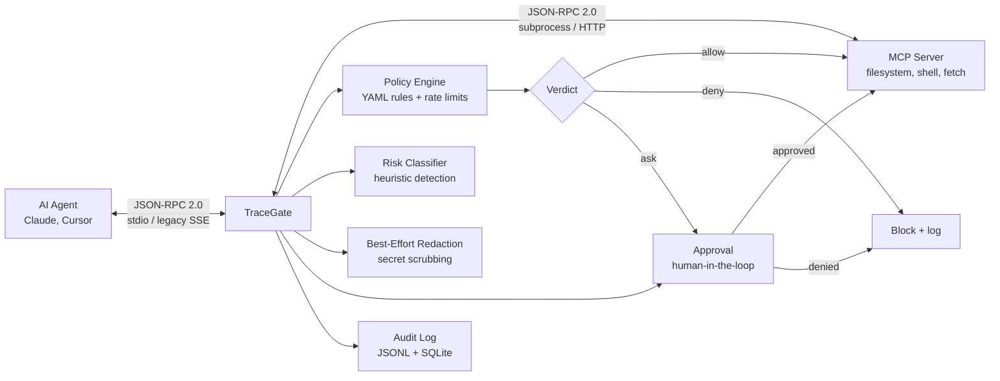

<div align="center">
  <h1>🛡️ TraceGate</h1>

  <p>
    <strong>A local-first MCP tool-call firewall for developers.</strong><br>
    Intercept, inspect, and enforce policies on every tool call your agent makes —
    <em>before</em> it touches your filesystem, shell, or network.
  </p>

  <p>
    <a href="https://github.com/kenny2077/TraceGate"></a>
    
    <a href="https://github.com/kenny2077/TraceGate"></a>
    <a href="LICENSE"></a>
  </p>

  <p><strong>⚠️ Not a sandbox. Not enterprise security. A defense-in-depth helper.</strong></p>
</div>

---

## What TraceGate Is

TraceGate is a **local-first MCP JSON-RPC tool-call policy proxy**. It sits between your AI coding agent (Claude, Cursor, Codex) and the MCP servers that expose filesystem, shell, and network tools. Every `tools/call` request is evaluated against a YAML policy you control.

**Key principle:** Trust, but verify — and make the verification inspectable.



TraceGate spawns the real MCP server as a child process and transparently relays stdin/stdout. For HTTP-based servers it operates as a **legacy HTTP+SSE compatibility proxy**. Because TraceGate owns the child process, a TraceGate crash kills the server with it — the system fails closed when the proxy fails.

---

## What TraceGate Protects Against

| Threat | Defense |
|---|---|
| Agent runs `rm -rf ~` by accident | Policy `deny` rules on destructive command patterns |
| Agent reads `.env`, `.ssh/id_rsa`, AWS credentials | Policy `deny` rules on sensitive paths + best-effort response redaction |
| Agent installs unknown packages or runs `curl \| bash` | Risk classifier flags + policy `ask` rules |
| Agent makes unexpected network requests | Policy `ask` / `deny` on `fetch`, `curl`, etc. |
| You need to review what the agent did later | JSONL + SQLite audit logs with filtering and replay |
| Agent sends a tool call with mutated arguments after approval | Approval memory binds to rule + tool + argument fingerprint |

---

## What TraceGate Does **Not** Protect Against

> TraceGate is **defense-in-depth**, not a silver bullet. These limitations are architectural, not bugs.

| Out of Scope | Why |
|---|---|
| **Traffic bypassing TraceGate** | If the agent connects directly to an MCP server, TraceGate cannot intercept it. |
| **Secrets already in the agent's context** | If the model has already seen a secret, redaction cannot erase its memory. |
| **Prompt injection / social engineering** | If an attacker tricks *you* into approving a malicious action, you are the vulnerability. |
| **OS-level sandbox escape** | TraceGate is a userspace proxy, not a kernel sandbox. |
| **Tamper-proof audit logs** | Logs are local files. A process with shell access can modify them. |
| **Windows approval prompts** | `/dev/tty` is Unix-specific. On Windows, `ask` rules become `deny`. |
| **Current MCP Streamable HTTP** | TraceGate supports stdio and legacy HTTP+SSE. Streamable HTTP is on the roadmap. |

For maximum safety, run TraceGate alongside OS-level sandboxing, least-privilege file permissions, and code review of the MCP servers you trust.

See [`docs/THREAT_MODEL.md`](docs/THREAT_MODEL.md) for the full security model.

---

## 🚀 Quickstart

### 1. Install

```bash
pip install tracegate
```

Requires Python ≥3.11. Tested on macOS and Linux.

### 2. Create a policy

Save this as `policy.yaml`:

```yaml
version: 1
defaultAction: ask
dlpEnabled: true

rules:
  - id: block-destructive
    tool: execute_command
    match_args_contain:
      command: ["rm -rf", "rm -r", "sudo", "curl | bash"]
    action: deny

  - id: block-sensitive-reads
    tool: read_file
    match_args_contain:
      path: [".env", ".ssh", ".aws", "credentials"]
    action: deny

  - id: allow-project-reads
    tool: read_file
    match_args:
      path: "/home/*/projects/*"
    action: allow
    max_calls_per_session: 100

  - id: allow-known-apis
    tool: fetch
    match_args:
      url: "https://api.github.com/*"
    action: allow
    max_calls_per_session: 30
```

Validate it:

```bash
$ tracegate check-policy policy.yaml
✅ Policy 'policy.yaml' is valid. Loaded 4 rules. Default action: ask
```

### 3. Run a server through the proxy

```bash
tracegate proxy --policy policy.yaml -- \
  npx -y @modelcontextprotocol/server-filesystem /tmp
```

TraceGate starts, spawns the filesystem server, and begins relaying traffic. You'll see log output on stderr:

```
INFO: Spawning target server: npx -y @modelcontextprotocol/server-filesystem /tmp
INFO: Loading policy from policy.yaml
INFO: Session: 20251215_143022_a1b2c3d4
INFO: Audit log: ~/.tracegate/sessions/session_20251215_143022_a1b2c3d4.jsonl
```

When the agent attempts a blocked tool call, you'll see an approval prompt:

```
============================================================
  ⚠️  TraceGate: Approval Required
============================================================
  Tool:    execute_command
  Risk:    HIGH
  Reason:  Matched rule block-destructive
  Args:
    {
      "command": "rm -rf /tmp/build"
    }
  Always will apply to: rule=ask-shell, tool=execute_command, args_fingerprint=abc123...
  Allow this action? [y/N/always/never]:
```

### 4. Inspect the session

```bash
# List all sessions
$ tracegate sessions
┌──────────────────────────┬────────┬─────────────────────┬──────────────────────────────────────┐
│ Session ID               │ Events │ Started             │ File                                 │
├──────────────────────────┼────────┼─────────────────────┼──────────────────────────────────────┤
│ 20251215_143022_a1b2c3d4 │     47 │ 2025-12-15T14:30:22 │ session_20251215_143022_a1b2c3d4.jsonl│
└──────────────────────────┴────────┴─────────────────────┴──────────────────────────────────────┘

# Replay a session in the terminal
$ tracegate replay 20251215_143022_a1b2c3d4 --filter risk=high

# Or launch the dashboard
$ pip install "tracegate[dashboard]"
$ tracegate dashboard
Starting TraceGate Dashboard on http://127.0.0.1:8080
```

Open `http://localhost:8080` to browse the timeline.

---

## Usage

### Proxy an stdio server

```bash
tracegate proxy \
  --policy policy.yaml \
  --log-dir ~/.tracegate/sessions \
  -- python -m my_mcp_server --port 9000
```

Everything after `--` is the server command and its arguments. TraceGate spawns it as a subprocess and relays stdin/stdout.

### Proxy a legacy SSE server

```bash
tracegate proxy \
  --mode sse \
  --target http://localhost:8000 \
  --policy policy.yaml \
  --port 8080
```

TraceGate listens on `:8080/sse` and forwards to the target. This implements **legacy HTTP+SSE compatibility**, not the current MCP Streamable HTTP transport.

### Auto-install into your IDE

```bash
tracegate install
```

Discovers Claude Desktop (`claude_desktop_config.json`) and Cursor (`.cursor/mcp.json`) configs, wraps every MCP server command with `tracegate proxy`, and saves a `.tg.bak` backup of the original config.

```bash
tracegate uninstall
```

Restores the backup. Your original config is back as if nothing happened.

### Dashboard

```bash
pip install "tracegate[dashboard]"
tracegate dashboard
```

Runs a local FastAPI server on `http://127.0.0.1:8080` with a dark-mode dashboard. Shows session history, risk distribution (doughnut chart), top tools (bar chart), and a filterable event timeline with expandable JSON-RPC payloads.

### Session management

```bash
tracegate sessions                          # list all recorded sessions
tracegate replay <id>                       # replay full timeline
tracegate replay <id> --filter risk=high    # only high-risk events
tracegate replay <id> --filter decision=denied  # only blocked calls
```

### Policy validation

```bash
tracegate check-policy policy.yaml
```

Returns rule count, default action, and any syntax or schema errors. Use this in CI or pre-commit hooks.

---

## Policy Configuration

TraceGate policies are YAML files. Rules are evaluated **top to bottom** — the first match wins. If no rule matches, `defaultAction` applies.

### Top-level fields

| Field | Type | Default | Description |
|:--|:--|:--|:--|
| `version` | int | *(required)* | Schema version. Currently `1`. |
| `defaultAction` | `allow` \| `deny` \| `ask` | `ask` | Fallback when no rule matches. |
| `dlpEnabled` | bool | `true` | Enable best-effort secret redaction on responses. |
| `maxBytesReturned` | int | *(unlimited)* | Truncate string responses exceeding this byte count. |
| `caseSensitive` | bool | `true` | Default case sensitivity for matching. |
| `rules` | list | `[]` | Ordered rule list. |

### Rule fields

| Field | Type | Description |
|:--|:--|:--|
| `id` | string | Unique identifier. Used in logs and rate-limit tracking. |
| `tool` | string | Tool name to match. Supports `fnmatch` globs: `execute_*`, `read_*`. |
| `action` | `allow` \| `deny` \| `ask` | What to do when this rule matches. |
| `match_args` | dict | Key → glob pattern. Every key must match for the rule to fire. |
| `match_args_contain` | dict | Key → list of substrings. Any substring match on any key fires the rule. |
| `match_args_path` | dict | Dotted path → glob. E.g., `arguments.command`, `content.0.text`. |
| `match_args_recursive` | dict | Key hint → list of substrings. Searches entire nested argument tree. |
| `message` | string | Human-readable reason. Shown in logs and approval prompts. |
| `risk` | `low` \| `medium` \| `high` \| `critical` | Manual risk override for dashboard display. |
| `tags` | list | Freeform tags for filtering in the dashboard. |
| `max_calls_per_session` | int | After N matches in one session, switch to `deny`. |
| `case_sensitive` | bool | Override config-level `caseSensitive` for this rule. |

### Matching semantics

| Mechanism | Uses | Example |
|:--|:--|:--|
| `match_args` | `fnmatch` globs | `path: "/home/*/projects/*"` |
| `match_args_contain` | Substring search | `command: ["rm -rf", "curl \| bash"]` |
| `match_args_path` | Dotted path + glob | `"arguments.command": "git *"` |
| `match_args_recursive` | Recursive substring | `command: ["sudo", "rm -rf"]` |

Both `match_args` and `match_args_contain` can appear on the same rule — if both are present, both must match.

### Full example

```yaml
version: 1
defaultAction: ask
dlpEnabled: true
maxBytesReturned: 50000
caseSensitive: false

rules:
  # ── Hard blocks ──────────────────────────────
  - id: block-destructive
    tool: execute_command
    match_args_contain:
      command: ["rm -rf", "rm -r", "sudo rm", "curl | bash", "wget | bash"]
    action: deny
    risk: critical
    message: "Destructive command blocked by policy."

  - id: block-sensitive-paths
    tool: read_file
    match_args_contain:
      path: [".env", ".ssh", ".aws", ".kube", "id_rsa", "credentials"]
    action: deny
    risk: high
    message: "Reading sensitive files is blocked."

  # ── Rate-limited allows ──────────────────────
  - id: allow-local-reads
    tool: read_file
    match_args:
      path: "/home/*/projects/*"
    action: allow
    max_calls_per_session: 100

  - id: allow-safe-git
    tool: execute_command
    match_args_contain:
      command: ["git status", "git diff", "git log", "git add", "git commit"]
    action: allow
    max_calls_per_session: 200

  - id: allow-github-api
    tool: fetch
    match_args:
      url: "https://api.github.com/*"
    action: allow
    max_calls_per_session: 30

  # ── Everything else prompts for approval ─────
  # defaultAction: ask handles the rest
```

---

## 📸 Screenshots

<!--
  TODO: Add the following assets to an `assets/` directory:

  1. assets/dashboard-timeline.png
     - The main dashboard view with session selected, timeline visible,
       risk badges, and a few expanded tool calls showing arguments and results.

  2. assets/dashboard-analytics.png
     - The welcome/analytics view with risk distribution doughnut chart
       and top-tools bar chart.

  3. assets/terminal-demo.gif (or .svg / .png)
     - A terminal recording of `examples/demo.sh` running, showing:
       - Policy load confirmation
       - A blocked rm -rf call
       - A redacted .env read
       - The session replay
     - 15–20 seconds, terminal theme: dark.

  4. assets/approval-prompt.png
     - Close-up of the /dev/tty approval prompt with risk level and truncated args.

  Replace each comment below with the corresponding image.
-->

<div align="center">
  <p><em>Screenshots coming soon. In the meantime, run <code>examples/demo.sh</code> to see TraceGate in action.</em></p>
  <!--  -->
  <!--  -->
</div>

---

## Project Structure

```
tracegate/
├── src/tracegate/
│   ├── __init__.py          # version
│   ├── cli.py               # Typer CLI entry point
│   ├── proxy.py             # stdio subprocess interceptor
│   ├── sse.py               # legacy HTTP+SSE compatibility proxy (FastAPI)
│   ├── policy.py            # YAML parser, rule engine, session state
│   ├── risk.py              # heuristic risk classifier
│   ├── dlp.py               # best-effort secret redaction engine
│   ├── approval.py          # /dev/tty human-in-the-loop prompt
│   ├── audit.py             # JSONL audit logger + redaction
│   ├── store.py             # SQLite store for dashboard queries
│   ├── mcp.py               # JSON-RPC 2.0 message models
│   ├── installer.py         # Claude/Cursor config auto-discovery
│   ├── replay.py            # terminal session replay (Rich)
│   └── dashboard/
│       ├── api.py            # FastAPI routes + stats endpoints
│       └── static/
│           ├── index.html    # dashboard shell
│           ├── app.js        # vanilla JS + Chart.js client
│           └── style.css     # dark-mode glassmorphism theme
├── tests/
│   ├── test_proxy_e2e.py    # full stdio proxy integration
│   ├── test_policy.py        # rule matching, session state
│   ├── test_policy_v2.py     # nested path, recursive, case sensitivity
│   ├── test_risk.py          # classifier patterns
│   ├── test_dlp.py           # redaction engine
│   ├── test_audit.py         # audit logging
│   ├── test_security_regressions.py  # adversarial fixtures
│   ├── test_store.py         # SQLite operations
│   ├── test_sse.py           # SSE proxy endpoints
│   ├── test_dashboard.py     # dashboard API
│   ├── test_installer.py     # config injection/reversion
│   ├── test_cli.py           # CLI dispatch
│   ├── test_replay.py        # replay rendering
│   └── conftest.py
├── examples/
│   ├── demo.sh               # one-command demo
│   ├── malicious_server.py   # simulated attack server
│   ├── policy.yaml            # example policy
│   ├── claude_desktop_config.json
│   ├── cursor_integration/   # manual Cursor setup guide
│   ├── docker_sse/           # Docker + SSE isolation example
│   └── antigravity_sdk/      # Python API integration demo
├── docs/
│   └── THREAT_MODEL.md       # security model and invariants
├── pyproject.toml
├── LICENSE
├── CHANGELOG.md
├── ROADMAP.md
├── SECURITY.md
└── CONTRIBUTING.md
```

---

## Security Model

TraceGate's security design is documented in [`docs/THREAT_MODEL.md`](docs/THREAT_MODEL.md). Key points:

- **Fail-closed when possible:** If the policy cannot be loaded, the proxy exits rather than passing traffic unchecked. If `/dev/tty` is unavailable, `ask` rules become `deny`.
- **Defense-in-depth:** Policy evaluation, risk classification, and response redaction are independent layers.
- **No trust in the agent:** All tool calls are evaluated regardless of origin.
- **Approval memory is scoped:** "Always" binds to rule + tool + argument fingerprint. Changing arguments requires re-approval.

### Security Invariants

1. A matching `deny` rule must not reach the target server.
2. An `ask` rule without approval must not reach the target server.
3. Policy load failure must not pass traffic.
4. Response redaction must happen before the agent sees the response.
5. Audit logs must not store obvious secrets in raw form.
6. Approval memory must bind to normalized argument fingerprints.

---

## 🗺️ Roadmap

### v0.2 (next)

- [ ] Windows support for approval prompts
- [ ] Policy hot-reload (watch file, no restart)
- [ ] Export sessions as JSON / CSV / HTML
- [ ] Configurable DLP patterns in policy.yaml
- [ ] Volume-limit deep truncation for dict/list responses (currently strings only)
- [ ] MCP Streamable HTTP transport support

### v0.3

- [ ] Notification webhooks (Slack, Discord) on critical events
- [ ] Multi-policy merging with priority ordering
- [ ] `tracegate init` to scaffold policies from templates (strict, permissive, CI-safe)
- [ ] Response scanning beyond DLP patterns
- [ ] Agent identity tracking
- [ ] Prometheus metrics endpoint

### Later

- [ ] Plugin system for custom risk classifiers and DLP patterns
- [ ] Signed policy files (Ed25519)
- [ ] Remote policy fetching (URL or git)
- [ ] gRPC transport support

### Non-Goals (explicitly out of scope)

- Static MCP server scanning (use [agent-scan](https://github.com/snyk/agent-scan) for that)
- Agent behavior analysis or anomaly detection
- Cloud-hosted policy management service
- Replacing OS-level sandboxing (TraceGate is defense-in-depth, not a sandbox)

See [`ROADMAP.md`](ROADMAP.md) for the full list.

---

## Contributing

Bug reports, feature requests, and pull requests are welcome. See [`CONTRIBUTING.md`](CONTRIBUTING.md) for:

- Dev environment setup
- Running tests and linting
- Architecture overview with module map
- PR process and conventions
- Good first issues

If you're adding a new risk pattern or DLP rule, tests are required.

---

## Security

TraceGate is a security product. If you discover a vulnerability, please **do not** open a public issue. See [`SECURITY.md`](SECURITY.md) for the responsible disclosure process and scope.

---

## License

MIT — see [`LICENSE`](LICENSE).

---

## Acknowledgements

TraceGate draws on ideas and patterns from several projects in the MCP security space:

- [edictum](https://github.com/nicholasgriffintn/edictum) — runtime policy engine for AI agent tool calls, with the first-match YAML rule model and `/dev/tty` approval pattern
- [agent-wall](https://github.com/agent-wall/agent-wall) — MCP security firewall with WebSocket dashboard and security modules
- [agent-scan](https://github.com/snyk/agent-scan) — static security scanning for MCP configurations and agent skills

Built with [FastAPI](https://fastapi.tiangolo.com), [Typer](https://typer.tiangolo.com), [Rich](https://rich.readthedocs.io), [Pydantic](https://docs.pydantic.dev), [Chart.js](https://chartjs.org), [uvicorn](https://uvicorn.org), and [SQLite](https://sqlite.org).
